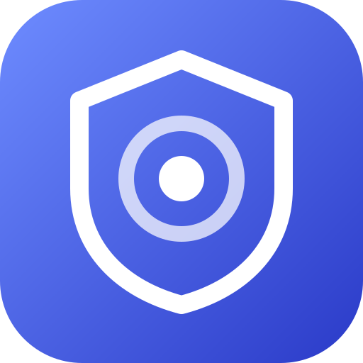

# dsh-tailnet-admin



把 Tailnet / 反向代理页面当作「本机」来用：让 DSH 的设置页在非回环地址上可用，并按需关掉浏览器会话校验
（Host/Origin 栅栏保持不动）。

> ⚠️ 这个插件会动到认证边界：**两个开关默认都关着**，装上去不改变任何行为。打开第二个之前，请先读
> [安全边界](#安全边界必读)。

## 它解决什么

从 `https://dsh.example.ts.net`（任何 Tailnet 服务名或反向代理域名）打开 DSH 时会撞上两件独立的事：

**① 设置页用不了**：模型与提供商目录、凭据、配置文件编辑器报
`settings are unavailable in this browser`。原因是 DSH 的浏览器端只把两种情况当作「本机」——由桌面壳
注入的 `globalThis.__DSH_TRANSPORT__ = { ownsHost: true }`，或页面自身的 `location.hostname` 属于回环
（`localhost` / `127.0.0.0/8` / `[::1]`）。域名进来的页面两者都不满足，于是设置走「进程内」持久化并直接
报不可用。**这条判定在浏览器端，服务端的 `--trusted-host` 管不到它。**

**② 每次重启都要重新换 token**：宿主的 `/api` 判定是「Host/Origin 栅栏 + 浏览器会话认证」两层。认证那层
要一个由 `?token=` 换来的、**按 authority 绑定**的 cookie；token 每次启动都重新生成，cookie 换地址即失效。

插件把这两件事拆成两个独立开关：`pageHosts` 解决 ①，`disableBrowserAuth` 解决 ②。为什么这么默认、
代价是什么，见 [.agents/notes/implemented/](.agents/notes/implemented)（中文）。

## 安装

前提：Node `^22.19.0 || >=24.0.0`（与官方 DSH 一致）。

### 1. 装包

```sh
npx @deepseek-ai/dsh plugin --profile web add @he0119/dsh-tailnet-admin
```

发布产物里带着编译好的 `lib/`，安装时不需要授权任何构建脚本。本地改代码时直接装仓库目录（先
`pnpm run build`）：

```sh
npx @deepseek-ai/dsh plugin --profile web add link:/path/to/dsh-tailnet-admin
```

### 2. 注册为 bundle

`dsh plugin add` 只做 `pnpm add`。DSH 启动时**只读** profile 清单里的 `dsh.profile.bundles`，所以还要把
包名加进去：

```json
// ~/.dsh/profiles/web/package.json
"dsh": {
  "profile": {
    "bundles": [
      // …
      "@he0119/dsh-tailnet-admin"
    ]
  }
}
```

用图形界面也行：**设置 → 插件**里会列出「已安装但未启用」的包，启用一次做的是同一件事。

改完重启 DSH（systemd 部署的话：`systemctl --user restart dsh-web`）。启动日志里会出现
`[dsh-tailnet-admin] …` 那两行，说明插件到位了。

### 3. 打开开关（配置页）

**设置 → 插件 → `dsh-tailnet-admin`**：本插件那张包页的描述下面就是配置表单，两个开关都在那儿。

- **按「本机」处理的页面主机**：一行一条。`.` 开头 = 后缀匹配（`.ts.net` 命中 `a.ts.net`，不命中裸
  `ts.net`），也可以写精确主机名，或写 `*` 命中全部。
- **关闭浏览器会话校验**：开关，默认关；打开前先读[安全边界](#安全边界必读)。

改完点**保存**。`disableBrowserAuth` 立刻生效，`pageHosts` 在**下一次打开页面**时生效（刷新一次即可），
两者都不需要重启 DSH。

> 第一次要绕个弯：`pageHosts` 还没命中当前页面的主机名时，浏览器端不把这些设置当作可持久化（原因见
> [它解决什么](#它解决什么)），配置页会明说「只写进这个浏览器」。所以第一个主机要么**从回环地址打开
> DSH**（`http://localhost:3080` 这种）在配置页里填，要么直接写 profile 的 `cordis.patch.yml`：

```yaml
# ~/.dsh/profiles/web/cordis.patch.yml
- id: tailnet-admin            # 这一行的 id 是本插件的固定约定：配置页按它取这一段设置，别改
  name: '@he0119/dsh-tailnet-admin'
  config:
    pageHosts:
      - .ts.net              # 也可以写精确主机名，或 `*`
    disableBrowserAuth: true # 默认 false；打开前先读「安全边界」
```

## 开关

| 开关 | 默认 | 作用 |
| --- | --- | --- |
| `pageHosts` | `[]` | 哪些页面主机按「本机」处理。`.` 开头 = 后缀匹配；`*` = 全部 |
| `disableBrowserAuth` | `false` | 是否关闭浏览器会话校验（token/cookie） |

两处写的是同一份配置：**插件配置页**（`设置 → 插件 → dsh-tailnet-admin`）保存时落到的就是 profile 里
`cordis.patch.yml` 那一行的 `config`；手工写文件与在页面上改完全等价，没有优先级之分。

- 规则表一行一条；配置页里也认逗号，从本文档抄一行过去不用改。
- 命不中的写法（`*.ts.net`、带协议或端口、带空格）在配置页里**当场挡住保存**：注入脚本只认 `*`、`.` 开头的
  后缀、精确主机名这三种，其余写进去只会静默不生效。
- 布尔量只认真正的布尔（YAML 的 `true` / `false`）。写成 `'true'` 这类字符串会被 Loader **拒绝加载**，
  而不是变成一个「打开」——一个手滑不该变成关掉认证。

systemd 部署只负责栅栏那一层，两个开关不走环境变量（见
[.agents/notes/implemented/](.agents/notes/implemented) 里的那条决策）：

```ini
[Service]
ExecStart=%h/.npm/_npx/<hash>/node_modules/.bin/dsh web --host 127.0.0.1 --port 3080 \
  --trusted-host dsh.example.ts.net --public-url https://dsh.example.ts.net/ --no-open
```

> `--trusted-host`（或 profile 里 connection 插件的 `trustedHosts`）是**另一条**独立要求：`/api` 的
> Host/Origin 栅栏只认回环或声明过的 authority。只开本插件的开关、不给 `--trusted-host`，请求会在栅栏
> 那一步就被 403 掉。
>
> `--public-url`（DSH `0.2.1-alpha.1` 起）是纯广告位：它只改 DSH 报出去的地址 —— 打印与打开的启动
> URL、`DSH_WEB_URL`、给模型的方位提示；不配置监听、路由或 cookie 作用域，**也不放宽信任**，所以替不掉
> 本插件的任何一个开关。它的用处是让 `?token=` 换 cookie 落在你真正使用的 authority 上，不必再手工把
> token 搬到对外地址。

## 安全边界（必读）

`disableBrowserAuth: true` 关掉的是「谁可以进这个界面」的认证。打开之后：

- **任何能打开这个页面的人**就等于拿到这台机器的控制权 —— 读写文件、执行命令、动用你在 DSH 里配置的
  API key。暴露面取决于 Tailscale ACL / 反向代理的访问控制，**不再取决于 token**。
- 保留下来的是 **Host/Origin 栅栏**：只认回环 Host 或 `--trusted-host` / `trustedHosts` 声明过的
  authority，并拒绝 `Sec-Fetch-Site: cross-site`。它挡的是 DNS 重绑定与跨站请求，**不挡**「知道地址的人」。
- 反过来，`pageHosts` 只影响**浏览器端**的设置持久化与界面可用性，它不改变服务端的任何判定。

建议的组合：`pageHosts` 按需开，`disableBrowserAuth` 只在真的被 token 反复打断时开；开了就顺手确认一下
Tailscale ACL 只放行你自己的设备。想撤回：在配置页把开关关掉（或把 `cordis.patch.yml` 里那两行改回去）
即可 —— `disableBrowserAuth` 立刻恢复，`pageHosts` 下一次打开页面时恢复，没有任何状态需要清理。

## 排障

| 现象 | 原因 |
| --- | --- |
| 设置页仍报 `settings are unavailable in this browser` | `pageHosts` 没命中当前页面的主机名（后缀匹配要带点：`.ts.net`），或改完还没刷新页面 |
| 请求直接 403 | Host/Origin 栅栏没过：给 `dsh web` 加 `--trusted-host <authority>` |
| 仍然要 `?token=` | `disableBrowserAuth` 没开（配置页里那个开关是关着的状态） |
| 启动日志里没有 `[dsh-tailnet-admin]` | 包名没写进 `dsh.profile.bundles`，或包没装上（`dsh --profile web --dump-config \| grep tailnet-admin` 可确认） |
| 配置页说「只写进这个浏览器」、保存后 profile 没变 | 当前页面没被当作「本机」：先从回环地址打开一次，或直接改 `cordis.patch.yml` |
| 配置页整段说「读不到这一节」 | `cordis.patch.yml` 里那一行的 `id` 不是 `tailnet-admin`，或者那一行没被启用 |

## 开发

构建、测试、以及「装进一个专用 profile 再看页面」的手动路径写在
[docs/development.md](docs/development.md)；为什么这么实现、踩过什么坑在
[docs/internals.md](docs/internals.md)；发布流程（含首版为什么必须手动发）在
[docs/releasing.md](docs/releasing.md)。

```sh
pnpm install     # 会顺带跑 prepare，也就是一次完整构建
pnpm test        # 单元测试（离线）
pnpm run typecheck
pnpm run build
```

## License

[MIT](LICENSE)
